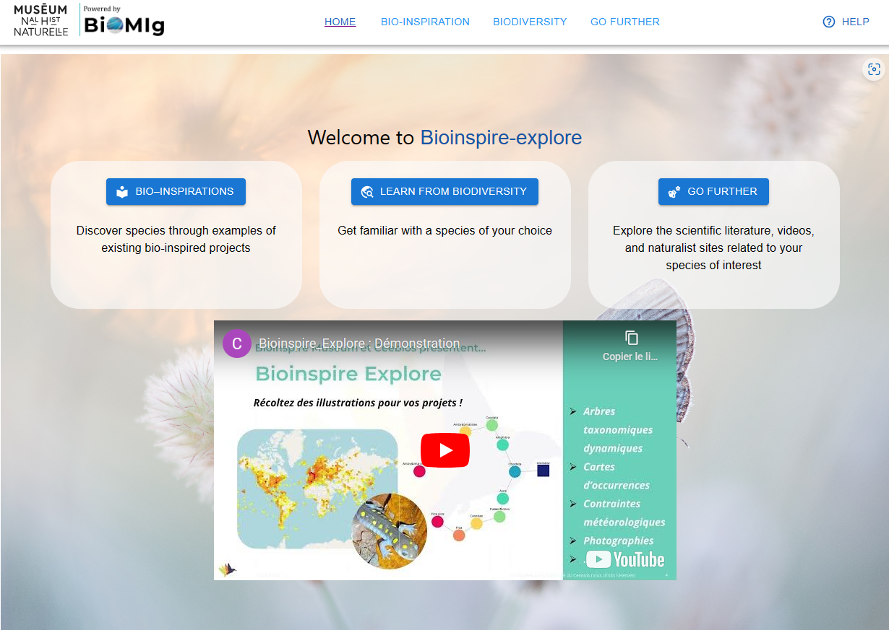

# Bioinspire-explore

    

## Description

**Bioinspire-Explore** supports bioinspired innovation by providing accessible and in-depth information about the biological world.

It is an open-source tool developed by the BiOMIg team at [CEEBIOS](https://ceebios.com/) in collaboration with the [MNHN](https://www.mnhn.fr/en/bioinspire-museum) and [Myceco](https://www.myceco.com/)

Using *Computer-Aided Biomimetics*, **Bioinspire-Explore** provides biological inspiration applicable to a wide range of fields, including design and engineering and even artistic endeavours.

**Get inspired by biodiversity with Bioinspire-Explore!** -> [Bioinspire-Explore](https://bioinspire-explore.mnhn.com/)

## Partners
- [Ceebios](https://ceebios.com/)
- [MNHN](https://www.mnhn.fr/en/bioinspire-museum)
- [Myceco](https://www.myceco.com/)
- [France Relance](https://www.economie.gouv.fr/plan-de-relance)
- [NextGenEU](https://next-generation-eu.europa.eu/index_en#make-it-green)

## Related projects
- [Biomig Search](https://www.biomig-search.com)

## Data

**Bioinspire-expore** uses data from the follwing sources:
- MNHN: Bioinspiration projects examples
- GBIF: Names, Taxonomy, Images and Distribution ranges of organisms
- Wikipedia: Article entries for selected organisms
- WorldClim: Climate data over distribution ranges
- Subset of Semantic Scholar S2ORC corpus: A selected set of 100,000 articles relevant for Biomimetics.
